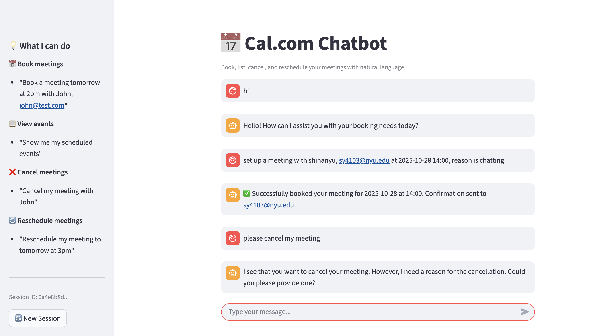

# 📅 Cal.com Chatbot

AI-powered chatbot for managing Cal.com meetings using natural language. Built with FastAPI, LangGraph, GPT-4, and Streamlit.



---

## Core Features

### Smart Conversations
- **Book Meetings** - "book a meeting tomorrow at 2pm with John, john@test.com"
- **View Schedule** - "show my scheduled events"
- **Check Available Slots** - "what times are available tomorrow?"
- **Cancel Meetings** - "cancel my meeting with John" → System asks for reason → Cancellation completed
- **Reschedule Meetings** - "reschedule my 3pm meeting to tomorrow"
- **Batch Operations** - "book 2 meetings tomorrow at 9am and 2pm with Alice"
- **Multi-Step Tasks** - "show my schedule, then book tomorrow at 2pm with Alice, alice@test.com"
- **General Chat** - "what can you help me with?"

### Technical Features
- **Smart Intent Recognition** - GPT-4 classifies user intent with confidence scoring (≥ 0.6 to execute)
- **Batch Operation Detection** - Automatically detects "all", "both", "multiple" keywords and routes to orchestrator
- **Multi-turn Conversations** - Automatically asks for missing info (date, time, reason, etc.)
- **Plan-and-Execute Architecture** - Planner → Executor → Solver for complex multi-step tasks
- **Session Management** - 1-hour auto-expiration, conversation history support
- **LangSmith Tracing** - Optional monitoring of all LLM calls
- **Clean Logging** - Concise request/response logging for debugging

### Frontend & Backend
- **Backend** - FastAPI + LangGraph + GPT-4 + Cal.com API
- **Frontend** - Streamlit chat interface 
- **Fully Decoupled** - Communication via REST API

---

## Project Structure

```
cal.com-chatbot/
├── calcom_chatbot/          # Backend code
│   ├── main.py             # FastAPI server (session management, API endpoints)
│   ├── graph.py            # LangGraph workflow definition
│   ├── state.py            # Conversation state definition
│   ├── nodes/              # LangGraph nodes
│   │   ├── classifier.py       # Intent classification (with confidence)
│   │   ├── orchestrator.py     # Multi-step task orchestration (Planner-Executor-Solver)
│   │   ├── book_meeting.py     # Book meetings
│   │   ├── cancel_meeting.py   # Cancel meetings
│   │   ├── reschedule_meeting.py  # Reschedule meetings
│   │   ├── list_events.py      # List events
│   │   ├── get_slots.py        # Get available slots
│   │   └── response.py         # General responses
│   ├── prompts/
│   │   └── templates.py    # All LLM prompt templates
│   ├── tools/
│   │   └── cal_api.py      # Cal.com API wrapper
│   └── utils/
│       └── config.py       # Configuration (includes LangSmith setup)
│
├── frontend/                # Frontend code (optional)
│   ├── streamlit_app.py    # Streamlit chat interface
│   ├── requirements.txt    # Frontend dependencies
│   └── frontend_venv/      # Frontend virtual environment
│
├── requirements.txt         # Backend dependencies
├── .env                     # Environment variables
└── env.example              # Environment variables template
```

---

## 🚀 Quick Start

### Option 1: With Web UI (Recommended)

#### Step 1: Configure Environment

```bash
# 1. Copy environment template
cp env.example .env

# 2. Edit .env and fill in your credentials
# - OPENAI_API_KEY=your_key
# - CALCOM_API_KEY=your_key
# - CALCOM_USER_EMAIL=your_email
# - CALCOM_EVENT_TYPE_ID=your_id
```

#### Step 2: Install Dependencies

```bash
# Install backend dependencies
pip install -r requirements.txt

# Install frontend dependencies
cd frontend
pip install -r requirements.txt
cd ..
```

#### Step 3: Start Backend

```bash
python -m calcom_chatbot.main
```

**Expected Output**:
```
LangSmith tracing disabled
INFO:     Started server process [12345]
INFO:     Uvicorn running on http://0.0.0.0:8001
```

#### Step 4: Start Frontend (New Terminal)

```bash
cd frontend
source frontend_venv/bin/activate  # If using virtual environment
streamlit run streamlit_app.py
```

**Or run directly**:
```bash
cd frontend
streamlit run streamlit_app.py
```

**Expected Output**:
```
You can now view your Streamlit app in your browser.

  Local URL: http://localhost:8501
  Network URL: http://192.168.1.100:8501
```

#### Step 5: Open Browser

Visit: **http://localhost:8501**

---

### Option 2: API Only

```bash
# 1. Configure environment (same as above)
cp env.example .env

# 2. Install dependencies
pip install -r requirements.txt

# 3. Start backend
python -m calcom_chatbot.main

# 4. Test with curl
curl -X POST http://localhost:8001/chat \
  -H "Content-Type: application/json" \
  -d '{"message": "show my events", "session_id": "test"}'
```

---

## Environment Variables

### Required Configuration

Configure in `.env` file:

```bash
# OpenAI
OPENAI_API_KEY=sk-xxx

# Cal.com
CALCOM_API_KEY=cal_live_xxx
CALCOM_USER_EMAIL=your@email.com
CALCOM_EVENT_TYPE_ID=123456
CALCOM_API_BASE_URL=https://api.cal.com/v2
```

### Optional Configuration (LangSmith Tracing)

To monitor LLM calls, add:

```bash
LANGSMITH_TRACING=true
LANGSMITH_ENDPOINT=https://api.smith.langchain.com
LANGSMITH_API_KEY=lsv2_pt_xxx
LANGSMITH_PROJECT=cal.com-chatbot
```

### Getting Cal.com Credentials

1. Sign up at [Cal.com](https://cal.com)
2. Go to **Settings** → **Developer** → **API Keys**
3. Create a new API Key
4. Get Event Type ID:
   - Go to **Event Types**
   - Click on any event type
   - ID is in URL: `/event-types/{EVENT_TYPE_ID}`

---

## API Endpoints

Backend runs on `http://localhost:8001`

### `POST /chat` - Send Message

```bash
curl -X POST http://localhost:8001/chat \
  -H "Content-Type: application/json" \
  -d '{
    "message": "show my events",
    "session_id": "user123"
  }'
```

**Response**:
```json
{
  "response": "You have 2 upcoming events...",
  "intent": "list_events"
}
```

### `GET /` - Health Check

```bash
curl http://localhost:8001/
```

### `GET /sessions` - List All Sessions

```bash
curl http://localhost:8001/sessions
```

### `GET /sessions/{session_id}` - Get Conversation History

```bash
curl http://localhost:8001/sessions/user123
```

### `DELETE /sessions/{session_id}` - Clear Session

```bash
curl -X DELETE http://localhost:8001/sessions/user123
```

---

## 💬 Usage Examples

### Book a Meeting

```bash
curl -X POST http://localhost:8001/chat \
  -d '{
    "message": "book a meeting tomorrow at 2pm with John, john@test.com",
    "session_id": "demo"
  }'
```

**Multi-turn Conversation Example**:
```
User: "I want to book a meeting"
Bot:  "Sure! Please provide: date, time, attendee name and email"
User: "tomorrow at 2pm"
Bot:  "Got it. What's the attendee name and email?"
User: "John Doe, john@test.com"
Bot:  "✅ Successfully booked for 2024-12-16 at 14:00..."
```

### View Schedule

```bash
curl -X POST http://localhost:8001/chat \
  -d '{"message": "show my events", "session_id": "demo"}'
```

### Check Available Slots

```bash
curl -X POST http://localhost:8001/chat \
  -d '{"message": "what times are available tomorrow?", "session_id": "demo"}'
```

**Multi-turn Example**:
```
User: "when are you free?"
Bot:  "Which date would you like to check for available time slots?"
User: "tomorrow"
Bot:  "✅ Available time slots for 2024-12-16:
       📅 2024-12-16:
         • 09:00 - 09:30
         • 10:00 - 10:30
         • 14:00 - 14:30
         • 15:00 - 15:30"
```

### Cancel a Meeting

```bash
# Round 1: Specify meeting
curl -X POST http://localhost:8001/chat \
  -d '{"message": "cancel my meeting with John", "session_id": "demo"}'

# System asks for reason
# Round 2: Provide reason
curl -X POST http://localhost:8001/chat \
  -d '{"message": "I am too busy", "session_id": "demo"}'
```

**Response**:
```
✅ Successfully canceled: Meeting scheduled for 2024-12-16T14:00:00Z
Reason: I am too busy
```

### Reschedule a Meeting

```bash
curl -X POST http://localhost:8001/chat \
  -d '{
    "message": "reschedule my 3pm meeting to tomorrow at 2pm",
    "session_id": "demo"
  }'
```

**Response**:
```
✅ Successfully rescheduled: Meeting
From: 2024-12-15T15:00:00Z
To: 2024-12-16T14:00:00Z
```

### Batch Operations (NEW!)

#### Book Multiple Meetings
```bash
curl -X POST http://localhost:8001/chat \
  -d '{
    "message": "book tomorrow at 9am with Alice at alice@test.com and at 2pm with Bob at bob@test.com",
    "session_id": "demo"
  }'
```

**Response**:
```
✅ Successfully booked 2 meetings:
- Alice at 9:00 AM
- Bob at 2:00 PM
```


---

### Multi-Step Complex Tasks

```bash
curl -X POST http://localhost:8001/chat \
  -d '{
    "message": "show my schedule, then check available times tomorrow, then book a meeting at the first available slot with Alice at alice@test.com",
    "session_id": "demo"
  }'
```

**How it works** ([Plan-and-Execute Architecture](https://blog.langchain.com/planning-agents/)):

1. **Planner** (GPT-4):
   - Analyzes the complex request
   - Generates a task execution plan (DAG format)
   - Example plan:
     ```
     E1: list_events
     E2: book_meeting(date=2025-10-29, time=14:00, name=John, email=john@test.com)
     ```

2. **Executor**:
   - Executes tasks sequentially
   - Supports variable references (e.g., `#E1` refers to result of task E1)
   - Calls appropriate nodes (book_meeting, list_events, etc.)

3. **Solver** (GPT-4):
   - Integrates all task results
   - Generates a coherent, user-friendly summary
   - Returns final response

**Example Tasks**:

*Sequential operations*:
- "Check my schedule and book tomorrow at 2pm with John, john@test.com"
- "Show me free slots for next Monday, then book at 2pm with Alice"
- "List my events, then cancel the one with John"

*Batch operations*:
- "Book 3 meetings tomorrow at 9am, 11am, and 2pm with different people"

**Benefits**:
- Faster execution (fewer LLM calls)
- Lower cost (LLM only for planning & summarizing)
- Better quality (forced to "think through" entire task)
- Batch processing (handle multiple meetings at once)

---

## Architecture

### LangGraph Workflow

```
User Message
    ↓
Classifier Node (GPT-4)
    ├─ Intent classification + confidence scoring
    └─ Confidence >= 0.6 → Execute, < 0.6 → general
    ↓
Router
    ├─ book_meeting → Book Meeting Node
    ├─ list_events → List Events Node
    ├─ get_slots → Get Slots Node
    ├─ cancel_meeting → Cancel Meeting Node
    ├─ reschedule_meeting → Reschedule Meeting Node
    ├─ multi_step → Orchestrator Node
    │                  ├─ Planner (GPT-4): Generate task plan
    │                  ├─ Executor: Run tasks (E1, E2, E3...)
    │                  └─ Solver (GPT-4): Integrate results
    └─ general → Response Node
    ↓
Handler Node (GPT-4)
    ├─ Parse user input
    ├─ Call Cal.com API
    └─ Generate response
    ↓
Response
```

### Core Design Principles

1. **Plan-and-Execute for Multi-Step Tasks** - Complex requests use ReWOO-inspired 3-stage architecture:
   - **Planner**: GPT-4 generates task DAG with variable references (#E1, #E2)
   - **Executor**: Executes tasks sequentially, supports cross-task variable passing
   - **Solver**: GPT-4 integrates all results into coherent final response
2. **LLM Handles Interaction** - All user messages generated by LLM, code only executes operations
3. **Multi-turn Conversations** - Automatically asks for missing info (date, email, reason, etc.)
4. **Session Management** - In-memory storage, 1-hour auto-expiration

---

## 🛠️ Tech Stack

- **Backend**: FastAPI, LangGraph, LangChain
- **LLM**: OpenAI GPT-4
- **Frontend**: Streamlit
- **API**: Cal.com V2 API
- **Monitoring**: LangSmith (optional)

---

## 🚧 Future Plans

### Planned Features

#### Enhanced Batch Operations
- [ ] **Smart Batch Processing** - Automatically detect number of meetings instead of creating fixed number of tasks
- [ ] **Selective Batch Operations** - "cancel all meetings with John" or "reschedule all tomorrow's meetings"
- [ ] **Batch Confirmation** - Show preview before executing batch operations

#### Smarter Intelligence
- [ ] **Natural Time Understanding** - Better support for "next week", "in 2 hours", "end of month"
- [ ] **Timezone Support** - Automatic timezone detection and conversion
- [ ] **Conflict Detection** - Warn users about scheduling conflicts before booking
- [ ] **Smart Suggestions** - "You have 3 meetings tomorrow, would you like to reschedule some?"

#### Analytics & Insights
- [ ] **Meeting Statistics** - "How many meetings did I have this week?"
- [ ] **Time Analysis** - "How much time did I spend in meetings this month?"
- [ ] **Attendee Insights** - "Who do I meet with most often?"
- [ ] **Calendar Heatmap** - Visual representation of meeting density

#### Notifications & Reminders
- [ ] **Meeting Reminders** - Proactive reminders before meetings
- [ ] **Daily Digest** - "Here's your schedule for today"
- [ ] **Email/SMS Integration** - Send reminders via email or SMS
- [ ] **Webhook Support** - Custom notifications to external systems

#### Advanced Features
- [ ] **Custom Meeting Types** - Support different event types (15min, 30min, 1hr)
- [ ] **Meeting Templates** - Save frequently used meeting configurations
- [ ] **Recurring Meetings** - "Book weekly meetings with John every Monday at 2pm"
- [ ] **Meeting Notes** - Add and retrieve meeting notes/agendas
- [ ] **Attendee Management** - Add/remove multiple attendees
- [ ] **Location Support** - Specify meeting locations (Zoom, Google Meet, physical location)

#### Multi-language & Accessibility
- [ ] **Multi-language Support** - Support for Chinese, Spanish, French, etc.
- [ ] **Voice Input/Output** - Voice commands and text-to-speech responses
- [ ] **Mobile App** - Native mobile applications
- [ ] **Slack/Teams Integration** - Chatbot available in Slack and Microsoft Teams

#### Enterprise Features
- [ ] **Team Calendars** - Manage team members' calendars
- [ ] **Permission Management** - Role-based access control
- [ ] **Audit Logs** - Track all calendar operations
- [ ] **Custom Workflows** - Define custom approval workflows for meetings
- [ ] **Integration Ecosystem** - Connect with CRM, project management tools

#### Performance & Scalability
- [ ] **Caching Layer** - Cache frequent queries for faster responses
- [ ] **Database Integration** - Persistent storage for conversation history
- [ ] **Load Balancing** - Support for high-traffic scenarios
- [ ] **API Rate Limiting** - Protect against abuse

#### Developer Experience
- [ ] **GraphQL API** - Alternative API interface
- [ ] **Webhooks** - Real-time event notifications
- [ ] **SDK/Client Libraries** - Python, JavaScript, Go SDKs
- [ ] **Comprehensive Testing** - Unit tests, integration tests, E2E tests
- [ ] **Documentation** - API docs, developer guides, video tutorials

---

## 📝 License

MIT


